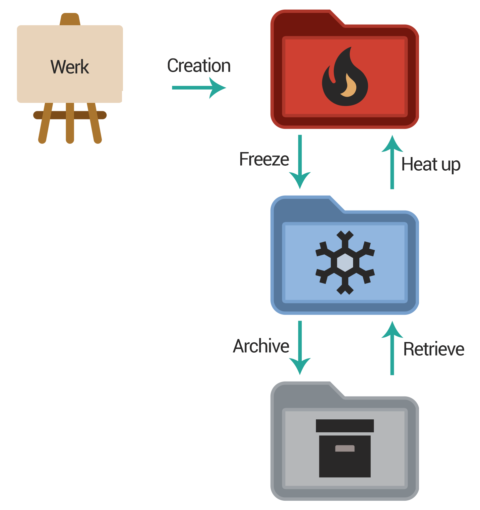

# Werkbank


**Werkbank** (German word for *workbench*): A simple tool to manage and store work pieces. It is powered by [Node](https://nodejs.org), [Electron](https://www.electronjs.org), [Vue](https://vuejs.org) and [Vuetify](https://vuetifyjs.com).

## Requirements

I have created hundreds of digital Werke (German word for *work pieces*) over the last two decades. Most of which are images, videos, music and software. These work pieces need to be organized.

- To keep it all nice and tidy, a folder structure must be enforced for all my work pieces.
- To not be slowed down while working, the current work pieces need to be on my fastest hard drive.
- To be able to work from different machines, the current work pieces also need to be synchronized.
- To not bloat my fastest drive, currently idle work pieces can be moved to a slower drive.
- To not bloat any of my drives, old work pieces should be archived (and preferably compressed).

## Solution

The solution to all these requirements is the three layer model of Werkbank: The **hot** directory contains all the projects I am currently working on. It is placed on my fastest drive and also part of my dropbox. The **cold** directory contains all the idle projects. It is placed on a hard drive with a lot of space. The **archive** is a large offline drive that I plug in whenever I need to.
Werkbank allows me to move *Werke* across those directories without a hassle.

### Werk Lifecycle



### Environments

Each werk has to be placed into an environment. Environments are subfolders within the state (hot, cold, archived) folders. Environments allow to configure ignore lists, so not all folders of a werk are kept when moving it to a different state folder. For the environment `JavaScript` the list will most likely contain the entry `node_modules`.

Additionaly environments allow to preset werk configurations. I want my video files to not be compressed into a zip when moved to the archive, as it would take too much time. Therefor I preset the `compress on archive` flag for video work pieces to `false`.

## ToDo

- fix the spinner flicker when gathering werke
- fix scrollbar jumps when showing fullscreen dialogs
- add linux build
- add github/gitlab support
  - repository creation
  - button in table row to open remote url in browser
- add keybindings/shortcuts
- add screenshots of application once it is finished
- Module parse error Unexpected character '�'

## Development

```sh
# Setup
yarn install

# Compiles and hot-reloads for development
yarn electron:serve

# Compiles and minifies for production
yarn electron:build

# Run unit tests
yarn test:unit

# Lints and fixes files
yarn lint

# Publish new version
yarn new-version x.x.x
```
